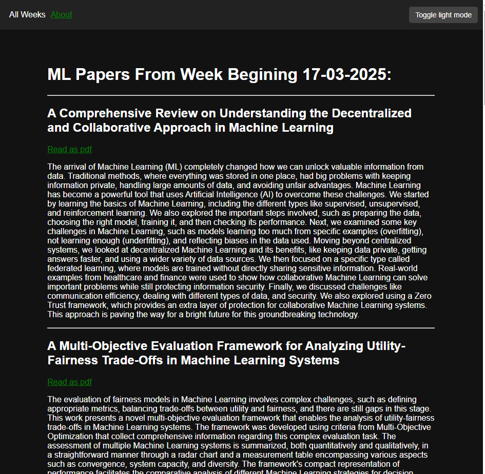

# django-ml-papers

## Overview
This Django project automatically updates a list of 10 new machine learning/AI research papers every week. It's designed to keep researchers and enthusiasts informed about the latest developments in the field, without having to rely on clickbait articles.

## Features
- Automatically fetches and updates new machine learning/AI papers weekly from arxiv.org.
- Provides a clean interface to search through and read abstracts of the updated papers.
- Provides links to read through the papers as PDFs
- Allows users browse through papers from previous weeks.

## Installation
1. Clone the repository:
    - git clone https://github.com/iainmckirdy/django-ml-papers.git

2. Install dependencies:
    - pip install -r requirements.txt

3. Apply migrations:
    - python manage.py makemigrations
    - python manage.py migrate

4. Run the development server:
    - python manage.py runserver

5. Access the application at `http://localhost:8000`.

## Usage
- Navigate to the homepage to see the latest batch of 10 research papers.
- Use the All Weeks Menu on the top bar to browse previous weeks.
- Click on a paper to view its details and related information.
- Papers will be updated every monday with new research articles from the previous week.
- This project utilises Django-crontab, therefore will only work on unix based systems.

## License
[MIT License](https://opensource.org/license/mit)

## Acknowledgements
- This project uses Django and integrates with arxiv.org.

##
This project is by Iain Mckirdy
